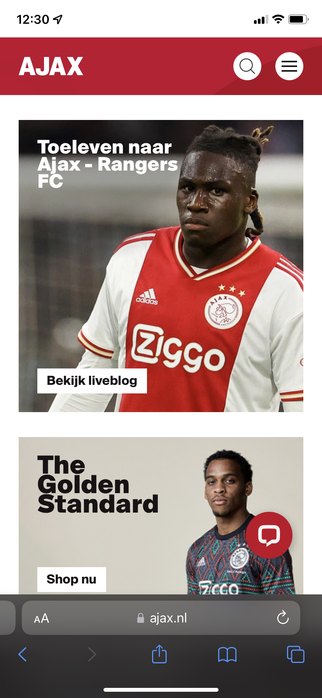
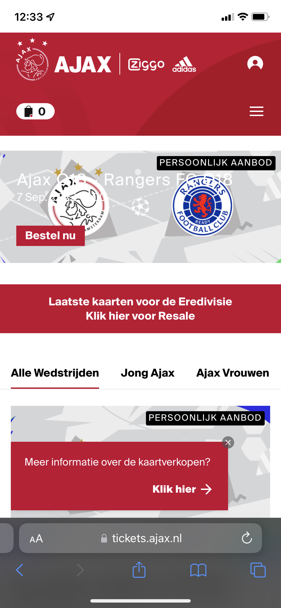

# Procesverslag
Markdown is een simpele manier om HTML te schrijven.  
Markdown cheat cheet: [Hulp bij het schrijven van Markdown](https://github.com/adam-p/markdown-here/wiki/Markdown-Cheatsheet).

Nb. De standaardstructuur en de spartaanse opmaak van de README.md zijn helemaal prima. Het gaat om de inhoud van je procesverslag. Besteedt de tijd voor pracht en praal aan je website.

Nb. Door *open* toe te voegen aan een *details* element kun je deze standaard open zetten. Fijn om dat steeds voor de relevante stuk(ken) te doen.

## Jij

  
uitwerken voor kick-off werkgroep

  ### Auteur:
 Jornt Bon

  #### Je startniveau:
  Blauw

  #### Je focus:
  Surface plane
 

## Je website

  

  MOBILE FIRST! Dan uitwerken. 
  

  ### Je opdracht:
  https://www.ajax.nl/

  #### Screenshot(s) van de eerste pagina (small screen): 
  Beginpagina Ajax.nl op smartphone. 
  

  #### Screenshot(s) van de tweede pagina (small screen):
  Ticketpagina Ajax.nl op smartphone. 
  
 

## Toegankelijkheidstest 1/2 (week 1)

  
uitwerken na test in 1e werkgroep

  ### Bevindingen
  Lijst met je bevindingen die in de test naar voren kwamen:
  - Het is vrijwel onmogelijk om te navigeren. Door middel van tab kunnen beperkte gebruikers alsnog door de website heen, hiervoor moet de HTML semantisch correct zijn en zeer toegankelelijk. Elementen moeten stuk voor stuk 'navigeerbaar' zijn voor mensen die "tabben", maar er moeten ook hulplijnen of versoeplingen verwerkt zijn zodat beperkte gebruikers niet 20 keer hoeven te "tabben" voordat ze ergens komen.

  #### Screenreader
  Hier korte omschrijving (met indien nodig afbeeldingen)
  De screenreader leest vrijwel alles voor, ook onnodige informatie. Daarnaast worden 'urls' en andere technische begrippen gebruikt waar niet elke gebruiker kennis van heeft. De screenreader leest alles voor, ookal is het irrelevant.

  Hier een omschrijving van hoe het opgelost kan worden (met indien nodig afbeeldingen)

  Door een correcte semantische HTML, met de juiste 'alt' omschrijvingen, kan het gebruik van een screenreader de gebruikerservaring flink verbeteren. Daarnaast kunnen shortcuts en andere hulpmiddelen binnen de HTML/CSS het gebruik van de screenreader óók verbeteren.

  #### Muis en Toetsenbord 
  Hier korte omschrijving (met indien nodig afbeeldingen)
  Door enkel gebruik te maken van of de muis of het toestenbord, komen er bepaalde dingen aan het licht. Zo 'tab' je niet altijd in logische volgorde door een website. Ook kunnen er gevallen voorkomen waar niet meer duidelijk is welke elementen geselecteerd zijn. Dit komt voor als elementen in de HTML wél geselecteerd kunnen worden maar niet zichtbaar zijn op de pagina. De muis alleen heeft wel duidelijke indicatie van waar de muis zicht begeeft en of iets klikbaar is of niet. 

  Hier een omschrijving van hoe het opgelost kan worden (met indien nodig afbeeldingen)
  Door de navigatie-volgorde van de elementen correct te plaatsen wordt navigeren met enkel toetsenbord al stukken gemakkelijker. Verder moet de HTML zo worden geschreven dat elementen die zicthbaar & relevant zijn geselecteerd kunnen worden en de rest niet.

  #### Motoriek (shocks, elastiekjes)
  Hier korte omschrijving (met indien nodig afbeeldingen)
  Het gebruik van toets en muis is moeilijker, maar niet onmogelijk. Alles duurt iets langer; typen, navigeren, klikken. Toch is motorische stoornis vaak lastig bij kleine buttons, moeilijk klikbare links etc.

  Hier een omschrijving van hoe het opgelost kan worden (met indien nodig afbeeldingen)
  Door buttons en links de juiste hovers mee te geven wordt het duidelijker wanneer iets klikbaar is, met de juiste CSS kan deze link of button ook echt klikbaarder worden. Hierdoor worden mensen met motorische stoornis geïncludeerd. 

  #### Visueel (brillen, contrast, kleurenblind, dark/light). 
  Hier korte omschrijving (met indien nodig afbeeldingen)
  Contrasten om knoppen, links, boodschappen etc. door te geven aan gebruikers worden minder snel / niet waargenomen. Hierdoor is het moeilijker om de gebruiker te sturen, waardoor er meer verwarring kan ontstaan. Ook kunnen dingen niet opvallen / zichtbaar zijn door gebrek aan contrast.

  Hier een omschrijving van hoe het opgelost kan worden (met indien nodig afbeeldingen)
  Door sterke contrasten te gebruiken, in grootte, vorm en kleur, en te testen in de contrastchecker kan er worden voorkomen dat mensen met kleurenblindheid o.i.d. de site verkeerd begrijpen.

## Breakdownschets (week 1)

  
uitwerken na afloop 2e werkgroep

  ### de hele pagina: 
  

  ### dynamisch deel (bijv menu): 
  

  ### wellicht nog een dynamisch deel (bijv filter): 
  

justify-content (space between)

## Voortgang 1 (week 2)

  
uitwerken voor 1e voortgang

  ### Stand van zaken
  hier dit ging goed & dit was lastig (neem ook screenshots op van delen van je website en code)

  ### Agenda voor meeting
  samen met je groepje opstellen

  | student 1      | student 2          | student 3    | student 4        |
  | ---            | ---                | ---          | ---              |
  | dit bespreken  | en dit             | en ik dit    | en dan ik dat    |
  | en dat ook nog | dit als er tijd is | nog een punt | dit wil ik zeker |
  | ...            | ...                | ...          | ...              |

  ### Verslag van meeting
  hier na afloop snel de uitkomsten van de meeting vastleggen

  - punt 1
  - punt 2
  - nog een punt
  - ...

## Voortgang 2 (week 3)

  
uitwerken voor 2e voortgang

  ### Stand van zaken
  hier dit ging goed & dit was lastig (neem ook screenshots op van delen van je website en code)

  ### Agenda voor meeting
  samen met je groepje opstellen

  | student 1      | student 2          | student 3    | student 4        |
  | ---            | ---                | ---          | ---              |
  | dit bespreken  | en dit             | en ik dit    | en dan ik dat    |
  | en dat ook nog | dit als er tijd is | nog een punt | dit wil ik zeker |
  | ...            | ...                | ...          | ...              |

  ### Verslag van meeting
  hier na afloop snel de uitkomsten van de meeting vastleggen

  - punt 1
  - punt 2
  - nog een punt
- ...

## Toegankelijkheidstest 2/2 (week 4)

  
uitwerken na test in 8e werkgroep

  ### Bevindingen
  Lijst met je bevindingen die in de test naar voren kwamen (geef ook aan wat er verbeterd is):

  #### Screenreader
  Hier korte omschrijving (met indien nodig afbeeldingen)

  Hier een omschrijving van hoe het opgelost kan worden (met indien nodig afbeeldingen)

  #### Muis en Toetsenbord 
  Hier korte omschrijving (met indien nodig afbeeldingen)

  Hier een omschrijving van hoe het opgelost kan worden (met indien nodig afbeeldingen)

  #### Motoriek (shocks, elastiekjes)
  Hier korte omschrijving (met indien nodig afbeeldingen)

  Hier een omschrijving van hoe het opgelost kan worden (met indien nodig afbeeldingen)

  #### Visueel (brillen, contrast, kleurenblind, dark/light). 
  Hier korte omschrijving (met indien nodig afbeeldingen)

  Hier een omschrijving van hoe het opgelost kan worden (met indien nodig afbeeldingen)

## Voortgang 3 (week 4)

  
uitwerken voor 3e voortgang

  ### Stand van zaken
  hier dit ging goed & dit was lastig (neem ook screenshots op van delen van je website en code)

  ### Agenda voor meeting
  samen met je groepje opstellen

  | student 1      | student 2          | student 3    | student 4        |
  | ---            | ---                | ---          | ---              |
  | dit bespreken  | en dit             | en ik dit    | en dan ik dat    |
  | en dat ook nog | dit als er tijd is | nog een punt | dit wil ik zeker |
  | ...            | ...                | ...          | ...              |

  ### Verslag van meeting
  hier na afloop snel de uitkomsten van de meeting vastleggen

  - punt 1
  - punt 2
  - nog een punt
  - ...

## Eindgesprek (week 5)

  
uitwerken voor eindgesprek

  ### Je uitkomst - karakteristiek screenshots:
  

  ### Dit ging goed/Heb ik geleerd: 
  Korte omschrijving met plaatjes

  

  ### Dit was lastig/Is niet gelukt:
  Korte omschrijving met plaatjes

  

## Bronnenlijst

  
continu bijhouden terwijl je werkt

  Nb. Wees specifiek ('css-tricks' als bron is bijv. niet specifiek genoeg).

  1. bron 1
  2. bron 2
  3. ...

